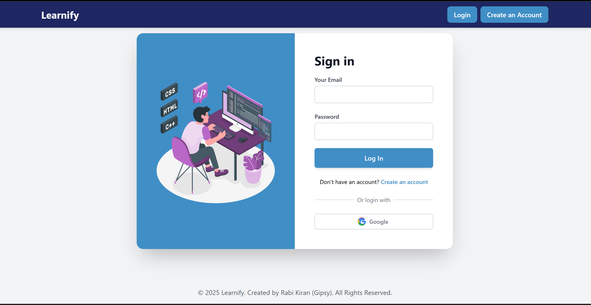
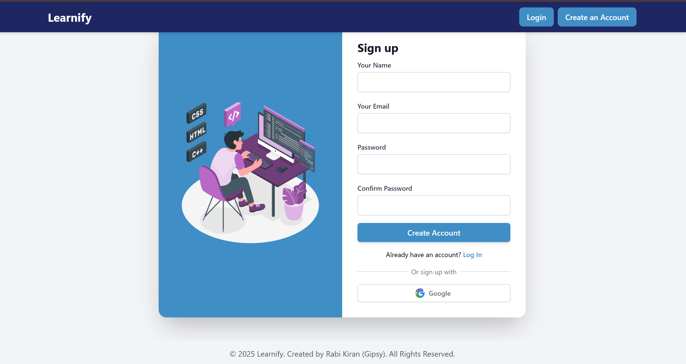
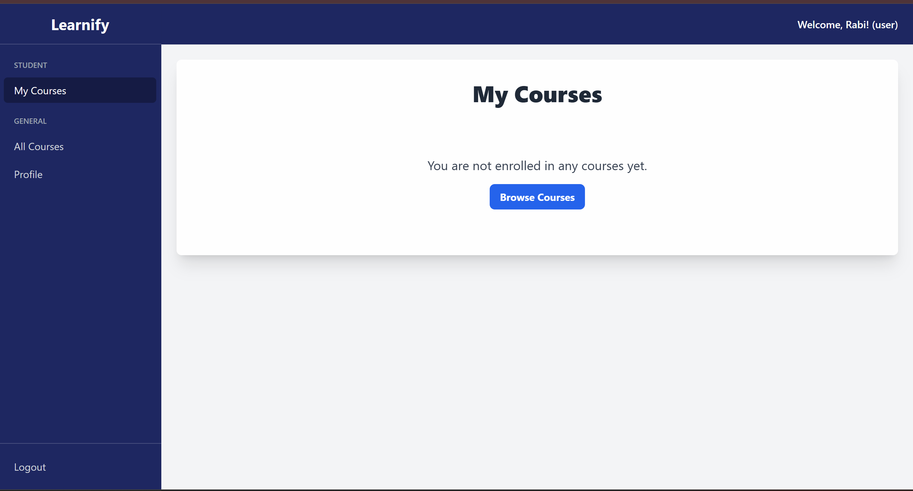
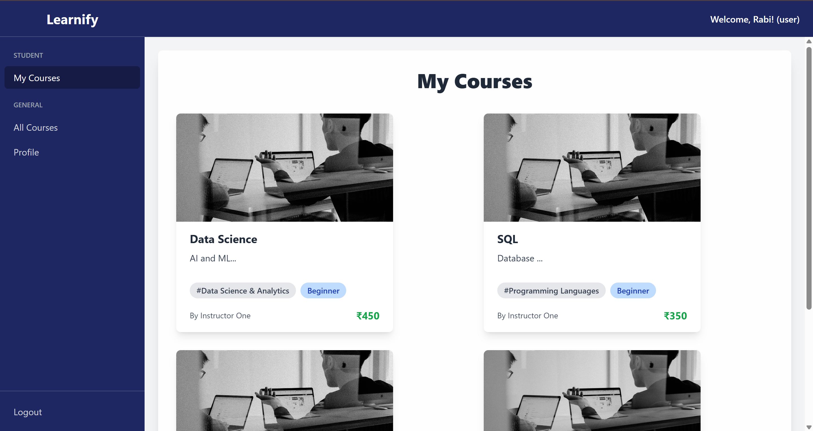
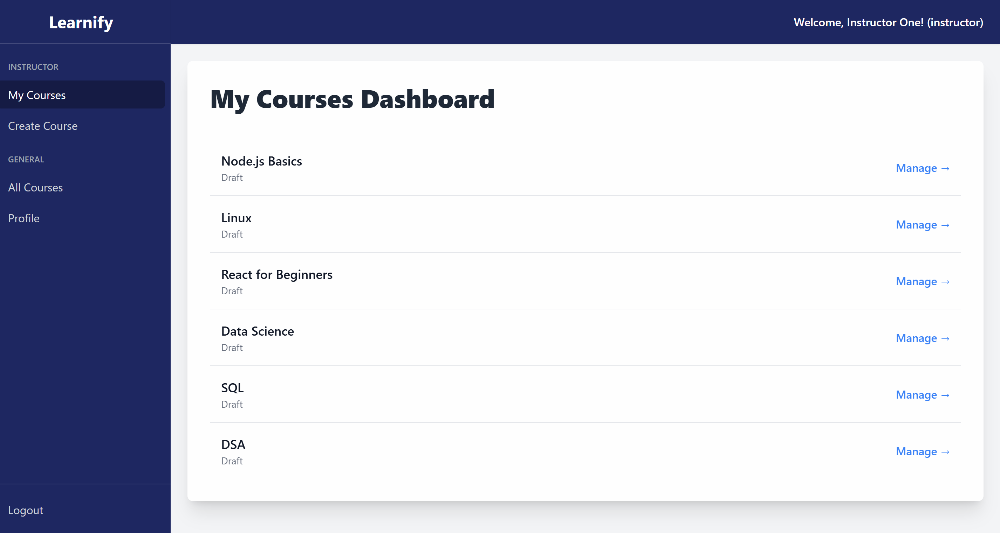
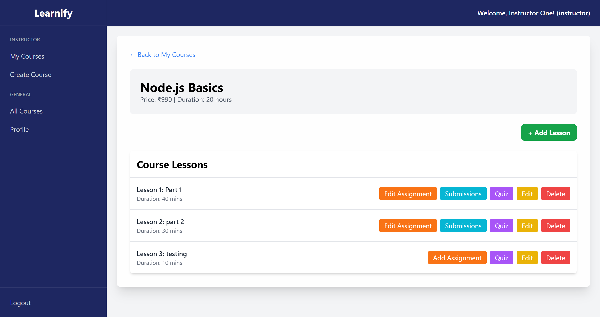
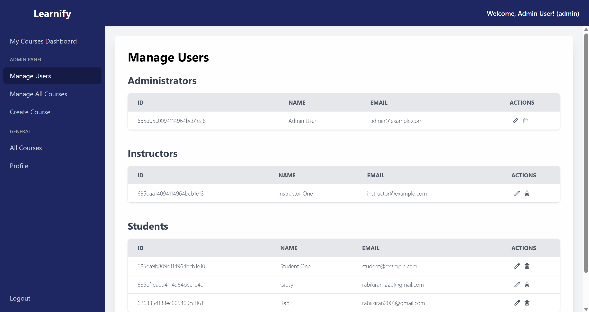
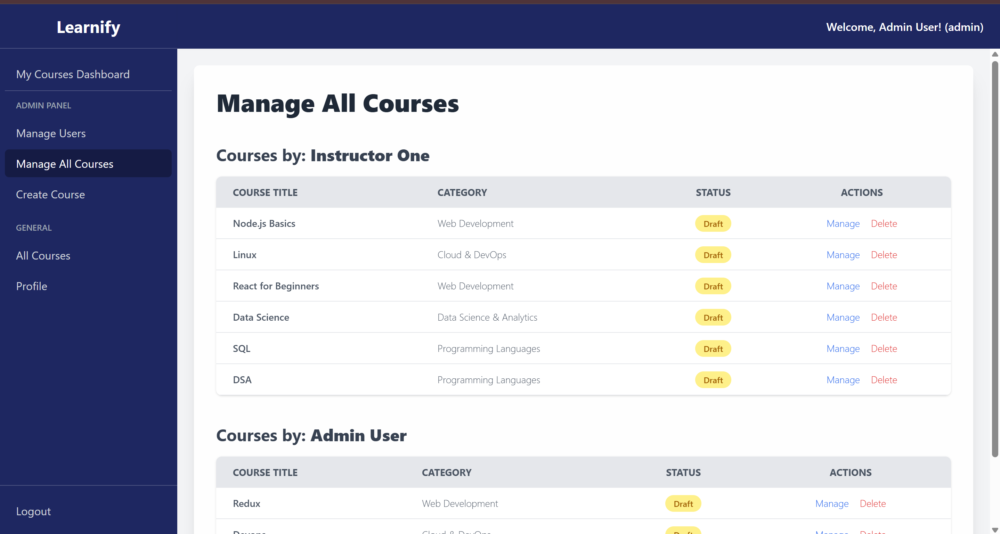

# Learnify – MERN Stack Online Learning Platform

A comprehensive, full-stack **online learning platform** built using the **MERN** stack (MongoDB, Express, React, Node.js). Learnify provides a powerful role-based system for **Students**, **Instructors**, and **Administrators** to deliver and consume educational content.

[](https://opensource.org/licenses/MIT)

**🔗 Live Demo:** https://learnify-three-black.vercel.app/

---

## 📸 Screenshots

### 🔑 Authentication
| Login Page | Register Page |
|------------|----------------|
|  |  |

### 🧑‍🎓 Student Interface
| Dashboard | Course Learning |
|-----------|------------------|
|  |  |

### 🧑‍🏫 Instructor Panel
| My Courses | Manage Course |
|------------|----------------|
|  |  |

### 👑 Admin Panel
| Users | Courses |
|--------|---------|
|  |  |

---

## ✨ Key Features

### 🧑‍🎓 Student
- Browse and enroll in courses
- View video/PDF/image-based lessons
- Track progress
- Take quizzes and submit assignments

### 🧑‍🏫 Instructor
- Create and manage courses
- Upload lessons (video, PDF, slides)
- Create quizzes and assignments
- Manage enrolled students

### 👑 Admin
- Full user management (promote/demote/delete users)
- View and manage all courses and categories
- Access instructor features

### 🔐 Authentication
- Secure JWT-based authentication
- Google OAuth login using Passport.js
- Role-based route protection

### 📚 Course System
- Full CRUD for courses, lessons, categories, and quizzes
- Video playback via React Player
- PDF viewing with react-pdf-viewer
- Image-based slides with Swiper.js

### 📊 Student Tracking
- Progress tracking (mark lessons complete)
- Conditional unlocking of next content
- Quiz scoring and assignment feedback

### 💎 Modern UI
- Responsive UI with Tailwind CSS
- Clean dashboards for each role
- Rich-text editing with react-quill

---

## 🛠️ Tech Stack

### Frontend
- **Framework/Library**: React + Vite
- **State Management**: Redux Toolkit + RTK Query
- **Routing**: React Router
- **Styling**: Tailwind CSS
- **Rich Text Editor**: react-quill
- **UI Components**: swiper (Slideshow), @react-pdf-viewer

### Backend
- **Runtime**: Node.js
- **Framework**: Express
- **Database**: MongoDB + Mongoose
- **Authentication**: JWT + Passport.js (Google OAuth)
- **File Storage**: Cloudinary (Image/file upload)
- **Email**: Nodemailer

### Deployment
- **Frontend**: Vercel
- **Backend**: Render

---

## 🚀 Run Locally

To get the development environment running, follow these steps.

1.  **Clone the repository:**
    ```sh
    git clone https://github.com/your-username/learnify.git
    cd learnify
    ```

2.  **Install dependencies for both client and server:**
    ```sh
    npm install
    cd client && npm install && cd ..
    cd server && npm install && cd ..
    ```

3.  **Set up Environment Variables:**

    You will need to create `.env` files in both the `server` and `client` directories. Copy the contents from `.env.example` (if available) or use the templates below.

    **`server/.env`**
    ```env
    NODE_ENV=development
    PORT=5000
    MONGODB_URI=your_mongodb_connection_string
    JWT_SECRET=your_jwt_secret
    SESSION_SECRET=your_session_secret

    CLOUDINARY_CLOUD_NAME=your_cloudinary_name
    CLOUDINARY_API_KEY=your_cloudinary_key
    CLOUDINARY_API_SECRET=your_cloudinary_secret

    GOOGLE_CLIENT_ID=your_google_client_id
    GOOGLE_CLIENT_SECRET=your_google_client_secret

    SMTP_HOST=smtp.gmail.com
    SMTP_PORT=587
    SMTP_USER=your_gmail_address
    SMTP_PASS=your_gmail_app_password
    ```

    **`client/.env`**
    ```env
    VITE_API_BASE_URL=http://localhost:5000
    VITE_GOOGLE_CLIENT_ID=your_google_client_id
    ```

4.  **Run the application:**

    From the root of the project, run the following command to start both the backend and frontend concurrently:
    ```bash
    npm run dev
    ```

    📡 **Backend will be running on:** `http://localhost:5000`

    🌐 **Frontend will be running on:** `http://localhost:5173`

---

## 🚢 Deployment Guide

### 🔧 Backend (Render)
1.  **Fork** the repository and connect it to your Render account.
2.  Create a new **Web Service**.
3.  **Root Directory**: `server`
4.  **Build Command**: `npm install`
5.  **Start Command**: `npm start`
6.  Go to the **Environment** tab and set the same variables as in your local `server/.env` file.

### 💻 Frontend (Vercel)
1.  **Fork** the repository and connect it to your Vercel account.
2.  Create a new **Project**.
3.  **Framework**: Select `Vite`.
4.  **Root Directory**: Set to `client`.
5.  **Environment Variables**:
    *   `VITE_API_BASE_URL`: The URL of your deployed Render backend (e.g., `https://learnify-backend.onrender.com`).
    *   `VITE_GOOGLE_CLIENT_ID`: Your Google Client ID.

---

## 👤 Author

**Rabi Kiran (Gipsy)**
*   Full Stack Developer | MERN Enthusiast
